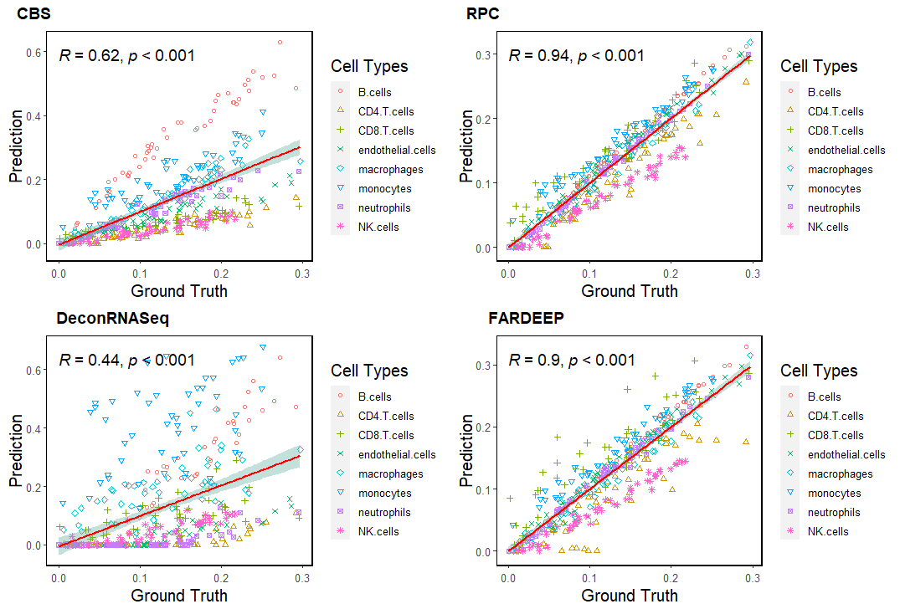

## **decone**: An easy-to-use and comprehensive evaluation toolkit for cell type deconvolution from expression data


* [Section 1: Introduction](#section-1-introduction)
* [Section 2: Installation](#section-2-installation)
* [Section 3: Gnerating Pseudo Bulk Data](#section-3-gnerating-pseudo-bulk-data)
    * [Section 3.1: Gnerating Pseudo Bulk Data From Massive RNA-seq Studies](#section-31-gnerating-pseudo-bulk-data-from-massive-rna-seq-studies)
    * [Section 3.2: Gnerating Pseudo Bulk Data From scRNA-seq data](#section-32-gnerating-pseudo-bulk-data-from-scrna-seq-data)
    * [Code Demo 1: Evaluating The Deconvolution Results In A Simple Manner](#code-demo-1-evaluating-the-deconvolution-results-in-a-simple-manner)
* [Section 4: Noise Analysis](#section-4-noise-analysis)
    * [Section 4.1: Generating Noised Bulk Data With Different Models](#section-41-generating-noised-bulk-data-with-different-models)
    * [Code Demo 2: Evaluating The Deconvolution Results For Multiple Method](#code-demo-2-evaluating-the-deconvolution-results-for-multiple-method)
* [Section 5: Rare Component Analysis](#section-5-rare-component-analysis)
* [Section 6: Unknown Component Analysis](#section-6-unknown-component-analysis)
* [Section 7: Single Cell Related Functions](#section-7-single-cell-related-functions)
* [Section 8: Well-Characterized Deconvolution Datasets](#section-8-well-characterized-deconvolution-datasets)
* [Citation](#citation)


**Links**:
- [decone manual](https://honchkrow.github.io/decone/inst/documents/decone_manual.pdf)
- [decone vignettes](https://honchkrow.github.io/decone/inst/documents/decone_intro.html)


## Section 1: Introduction
Cell type proportion is related to phenotypes or diseases ([Wang, *et al.*](https://doi.org/10.1038/s41467-018-08023-x), [Wei, *et al.*](https://doi.org/10.1093/bib/bbab362)). Therefore, quantifying cell or tissue proportions is important for understanding the mechanisms in biological processes.

Here, we proposed a cell type <u>**decon**</u>volution <u>**e**</u>valuating toolkit named '**decone**' to perform comprehensive and systematic evaluation of different algorithms.

**decone** consists of 6 main part functions as below.
- Pseudo bulk data generation (from massive bulk data and single cell data).
- Stability analysis under different types of noise.
- Rare component analysis.
- Unknown component analysis.
- Comprehensive evaluation metrics as well as pretty figure generation.
- Well-characterized datasets for deconvolution utilities.

In the following parts, we will give a comprehensive tutorial about decone.


## Section 2: Installation

decone is based on R and can be easily installed on Windows, Linux as well as MAC OS.

First, users should install [R >= 4.1.0](https://www.r-project.org/).

Next, install devtools and decone.

```
# install devtools
install.packages('devtools')

# install the decone package
devtools::install_github('Honchkrow/decone')

# load decone
library(decone)
```


## Section 3: Gnerating Pseudo Bulk Data

Generating pseudo-bulk data is a challenging problem. Inspired by the former work ([Francisco, *et al.*](https://doi.org/10.1038/s41467-020-20288-9), [Wang, *et al.*](https://doi.org/10.1038/s41467-018-08023-x), [Wei, *et al.*](https://doi.org/10.1093/bib/bbab362), [Racle, *et al.*](https://doi.org/10.7554/eLife.26476)) and [Tumor Deconvolution DREAM Challenge](https://www.synapse.org/#!Synapse:syn15589870/wiki/), decone provides different pseudo data generation strategies from massive bulk RNA-seq data as well as scRNA-seq data.


### Section 3.1: Gnerating Pseudo Bulk Data From Massive RNA-seq Studies

Many deconvolution methods need cell type-specific bulk data as the prior knowledge during deconvolution. To have a more realistic simulation, we collected 302 well-characterized bulk RNA-seq data to generate pseudo bulk data. When generating data, 1/3 samples will be used for generating the mixture and the rest will be used for generating external reference.

Inspired by [Tumor Deconvolution DREAM Challenge](https://www.synapse.org/#!Synapse:syn15589870/wiki/), decone also provides function to generate 'coarse' and 'fine' level mixture samples. 

For **'coarse'** level, decone generates mixture samples which contains the following 8 cell types.
- B cells
- CD4 T cells
- CD8 T cells
- endothelial cells
- macrophages
- monocytes
- neutrophils
- NK cells

For **'fine'** level, there will be 14 cell types.
- memory B cells
- naive B cells
- memory CD4 T cells
- active CD4 T cells
- regulatory T cells
- memory CD8 T cells
- naive CD8 T cells
- NK cells
- neutrophils
- monocytes
- myeloid dendritic cells
- macrophages
- fibroblasts
- endothelial cells

The following demo shows how to generate simulated samples. Considering that different deconvolution methods may be written in different languages, we output the simulated data as CSV files which can be easily loaded to R, Python as well as MATLAB.

```R
library(decone)

exprSim(n_sample = 50,  # generate 50 samples
        type = 'coarse',  # can be changed to 'fine'
        transform = 'TPM',
        outputPath = "./function_test/exprSim",
        mix_name = "coarse_mix.csv",  # mixture samples
        ref_name = "coarse_ref.csv",   # cell type specific reference
        prop_name = "coarse_prop.csv",  # groundtruth proportions
        refVar_name = "coarse_refVar.csv",  # expression variance for cell type specific reference
        train_name = "train_data.csv")  # data for generating reference, can be used for differential analysis
```

All the output files will be save in folder 'exprSim'. The proportion will be generated randomly from a uniform distribution ([Wei, *et al.*](https://doi.org/10.1093/bib/bbab362)). decone also outputs the data for generating the external reference (parameter '**train_name**' in function **exprSim**) which can be used for differential expression analysis in marker gene selection.


### Section 3.2: Gnerating Pseudo Bulk Data From scRNA-seq data

With the development of single cell technologies, the prediction of cell type proportion becomes more accurate. Lots of single cell-based methods had been proposed such as [MuSiC](https://doi.org/10.1038/s41467-018-08023-x) and [SCDC](https://doi.org/10.1093/bib/bbz166). In addition, constructing in silico bulk data also becomes direct. 

For a comprehensive simulation, decone provides two types of simulated bulk data. 

The first one is [human PBMC data from 10X](https://support.10xgenomics.com/single-cell-multiome-atac-gex/datasets/1.0.0/pbmc_granulocyte_sorted_10k). This single cell dataset contains more than 10k single cell from huamn blood. We processed this dataset with [10X Cell Ranger](https://support.10xgenomics.com/single-cell-gene-expression/software/pipelines/latest/what-is-cell-ranger) as well as [muon](https://muon.readthedocs.io/en/latest/). Cell type annotation is performed followed by the tutorial ['Processing gene expression of 10k PBMCs'](https://muon-tutorials.readthedocs.io/en/latest/single-cell-rna-atac/pbmc10k/1-Gene-Expression-Processing.html). We annotataed 13 cell types as below.

- intermediate_mono
- CD8+_naïve_T
- mDC
- CD4+_naïve_T
- NK
- memory_B
- CD4+_memory_T
- CD16_mono
- pDC
- naïve_B
- CD8+_activated_T
- CD14_mono
- MAIT

The second dataset comes from mouse tissue. Tissue level deconvolution is also an important question, such as the prediction of tissue origin from human liquid biopsy. [Han, *et al.*](https://doi.org/10.1016/j.cell.2018.02.001) built a scRNA-seq atlas for the mouse with high quality and decone adopted this study to perform in silico mixing. For a solid simulation, decone adopted 7 tissues from the femal fetal mouse and 1500 cells for each.

- stomach
- lung
- liver
- kidney
- intestine
- brain
- gonad

The method for generating bulk data is similar with Section 3.1.

```R
scExprSim(n_sample = 50,  # generate 50 samples
          p = 2 / 3,  # the proportion of cell number of building reference for each cell type
          transform = "TPM",
          outputPath = "./function_test/scExprSim",
          mix_name = "scMouse_gene_expr.csv",
          ref_name = "scMouse_ref.csv",
          prop_name = "scMouse_prop.csv",
          train_name = "scMouse_ref_rawCount.csv",  ## this file can be used for differential expression analysis
          type = 'mouse_tissue')  ## 'mouse_tissue' or 'human_PBMC'
```


### Code Demo 1: Evaluating The Deconvolution Results In A Simple Manner

Generally, when a new deconvolution approach is proposed, cross-comparison between different methods is needed. decone provides multi-level comparison and visualization functions. In this part, we will demonstrate how to perform a simple evaluation of deconvolution results.

We adopted [EpiDISH](https://www.bioconductor.org/packages/release/bioc/html/EpiDISH.html), [DeconRNASeq](http://bioconductor.org/packages/release/bioc/html/DeconRNASeq.html) as well as [FARDEEP](https://cran.r-project.org/web/packages/FARDEEP/index.html) from Bioconductor as the demo methods. Users can follow the steps below to reproduce the results easily.

First, generate simulated expression data. Here, we adopted the massive RNA-seq dataset as am example.

```R
library(decone)

# generate bulk data
exprSim(n_sample = 50,  # generating 50 samples
        type = 'coarse',
        transform = 'TPM', 
        outputPath = "./function_test/exprSim",
        mix_name = "coarse_mix.csv",
        ref_name = "coarse_ref.csv",   # cell type specific reference
        prop_name = "coarse_prop.csv",  # simulated/groudtruth proportions
        refVar_name = "coarse_refVar.csv")  # expression variance for cell type specific reference
```

Second, use [EpiDISH](https://www.bioconductor.org/packages/release/bioc/html/EpiDISH.html), [DeconRNASeq](http://bioconductor.org/packages/release/bioc/html/DeconRNASeq.html) and [FARDEEP](https://cran.r-project.org/web/packages/FARDEEP/index.html) to deconvolute the bulk data and save the result.

```R
library(EpiDISH)
library(DeconRNASeq)
library(FARDEEP)

mix <- read.csv(file = "./function_test/exprSim/coarse_mix.csv", header = T, row.names = 1)
ref <- read.csv(file = "./function_test/exprSim/coarse_ref.csv", header = T, row.names = 1)

# For a fast demo, we use only 500 markers.
mix <- as.matrix(mix[1:500, ])
ref <- as.matrix(ref[1:500, ])

# deconvolute with CIBERSORT algorithm
res1 <- epidish(beta.m = mix, ref.m = ref, method = "CBS")
p1 <- t(res1$estF)
# deconvolute with RPC algorithm
res2 <- epidish(beta.m = mix, ref.m = ref, method = "RPC")
p2 <- t(res2$estF)
# deconvolute with DeconRNASeq algorithm
res3 <- DeconRNASeq(datasets = as.data.frame(mix), signatures = as.data.frame(ref))
p3 <- t(res3$out.all)
colnames(p3) <- colnames(mix)
# deconvolute with FARDEEP algorithm
res4 <- fardeep(X = ref, Y = mix)
p4 <- t(res4$relative.beta)

# save the results
write.csv(x = p1, file = paste0("./function_test/exprSim/CBS.csv"), row.names = T, quote = F)
write.csv(x = p2, file = paste0("./function_test/exprSim/RPC.csv"), row.names = T, quote = F)
write.csv(x = p3, file = paste0("./function_test/exprSim/DeconRNASeq.csv"), row.names = T, quote = F)
write.csv(x = p4, file = paste0("./function_test/exprSim/FARDEEP.csv"), row.names = T, quote = F)
```

Next, users can compare the deconvolution results from multiple aspects.

For example, we can compare the rmse of each cell type directly.

```R
actual <- "./function_test/exprSim/coarse_prop.csv"
predicted <- c("./function_test/exprSim/CBS.csv",
               "./function_test/exprSim/RPC.csv",
               "./function_test/exprSim/DeconRNASeq.csv",
               "./function_test/exprSim/FARDEEP.csv")
label <- c("CBS", "RPC", "DeconRNASeq", "FARDEEP")

plot_multiple(actual = actual,
              predicted = predicted,
              label = label,
              method = "rmse",
              type = "celltype",  # can be changed to 'sample' 
              figure = "boxplot")
```

<center>
    
    <br>
    <div style="color:orange; border-bottom: 1px solid #d9d9d9;
    display: inline-block;
    color: #999;
    padding: 2px;">Boxplot of rmse value for each cell type</div>
</center>

We can also compare the rmse of each sample by changing parameter type from 'celltype' to 'sample'.

Also, the overall rmse can be illustrated by barplot.

```R
plot_multiple(actual = actual,
              predicted = predicted,
              label = label,
              method = "rmse",
              type = "all",
              figure = "barplot")
```

<center>
    
    <br>
    <div style="color:orange; border-bottom: 1px solid #d9d9d9;
    display: inline-block;
    color: #999;
    padding: 2px;">Barplot for overall rmse of each method</div>
</center>

In addition, the results can be revealed more specific through heatmap.

```R
plot_multiple(actual = actual,
              predicted = predicted,
              label = label,
              method = "rmse",
              type = "celltype",
              figure = "heatmap")
```

<center>
    
    <br>
    <div style="color:orange; border-bottom: 1px solid #d9d9d9;
    display: inline-block;
    color: #999;
    padding: 2px;">Heatmap for cell type rmse of each method</div>
</center>

The scatter plot with Pearson Correlation Coefficient (PCC) for each method can also be produced.

```R
plot_multiple(actual = actual,
              predicted = predicted,
              label = label,
              method = "pearson",
              type = "celltype",  # the color is assigned for each cell type
              figure = "scatterplot",
              nrow = 2)
```

<center>
    
    <br>
    <div style="color:orange; border-bottom: 1px solid #d9d9d9;
    display: inline-block;
    color: #999;
    padding: 2px;">Scatter plot for each method</div>
</center>

The combined heatmap with circles can be used for illustrating multiple metrics at once.

<center>
    
    <br>
    <div style="color:orange; border-bottom: 1px solid #d9d9d9;
    display: inline-block;
    color: #999;
    padding: 2px;">Heatmap with circles</div>
</center>

If the users want to plot the results for a single method, the 'plot_single' function can be used. For more information, please see [decone manual](https://honchkrow.github.io/decone/inst/documents/decone_manual.pdf)


## Section 4: Noise Analysis

In expression data analysis, technical and biological noise cannot be ignored. Noise existing in bulk data brings a negative influence on deconvolution. In order to measure the stability and accuracy of different methods, decone provides functions to add noise with the different structures on bulk data.


### Section 4.1: Generating Noised Bulk Data With Different Models

Many of the noise model had been used in different studies, such as the normal, log-normal and negative binomial model ([Jin, *et al.*](https://doi.org/10.1186/s13059-021-02290-6)). decone realized these methods and provided flexible interface for users.

- **Normal Model**

$$\textbf{M} = 2^{log_{2}(\textbf{R} \times \textbf{p} + 1) + N(0, \sigma p_t)}$$

- **Log-Nomal Model**

$$\textbf{M} = \textbf{R} \times \textbf{p} + 2^{N(0, \sigma p_t)}$$

In the above 2 model, $\textbf{M}$ means the mixture sample, $\textbf{R}$ and $\textbf{p}$ represent the reference and proportion respectively. The level of noise is controlled by  the product of a constant parameter $\sigma$ and a perturbation level parameter $p_t$ ([Jin, *et al.*](https://doi.org/10.1186/s13059-021-02290-6)). As the former study pointed, the $\sigma$ is set to 10 and $p_t$ is set from 0 to 1 by 0.1.

- **Negative Binomial Model**

$$\mu_{i0} = r_{i0} \times L_{j}$$
$$\mu_{ij} = Gamma(shape = \frac{1}{\sigma_{i}^{2}}, scale = \frac{\mu_{i0}}{shape})$$
$$sigma_{i} = (1.8 \times p_{t} + \frac{1}{\sqrt{\mu_{i0}}}) \times exp(\frac{\delta}{2}) \qquad \delta \sim N(0, 0.25)$$
$$v_{ij} = Possion(\mu_{ij})$$

The simulation strategy is proposed by [Jin, *et al.*](https://doi.org/10.1186/s13059-021-02290-6) and [Law, *et al.*](https://doi.org/10.1186/gb-2014-15-2-r29). $p_t$ is also used to control noise level, from 0 to 1. $r_{i0}$ is the expected genomic feature proportion of gene i in a cellular component. $L_{j}$ is the library size of sample $j$. $\mu_{i0}$ is the expected gene expression in the simulation. Two layers of variance are added from the gamma distribution and poisson distribution. For more information, please see [this article](https://doi.org/10.1186/s13059-021-02290-6).

Function "addNoiseExpr" can produce noise based on normal, log-normal or negative binomial model ([Jin, *et al.*](https://doi.org/10.1186/s13059-021-02290-6)). We strongly recommended using the **negative binomial** model. A simple example is provided as the following code.

```R
# first, generate a simple dataset with 50 samples and 200 marker genes with function 'pseudoExpr'
res <- pseudoExpr(n_sample = 50, n_gene = 200)

# users can check the dimension of output
dim(res$mix)
dim(res$ref)
dim(res$prop)

# save the bulk data
# save the bulk data
write.csv(x = res$mix, file = "./function_test/addNoiseExpr/mix.csv", row.names = T, quote = F)
write.csv(x = res$ref, file = "./function_test/addNoiseExpr/ref.csv", row.names = T, quote = F)
write.csv(x = res$prop, file = "./function_test/addNoiseExpr/prop.csv", row.names = T, quote = F)


# the new data will be generated in a folder
addNoiseExpr(exprFile = "./function_test/addNoiseExpr/mix.csv",
             Pt = seq(0.1, 1, 0.1),  # parameter to control noise level
             type = "NB")  # "NB", "N" or "LN". 3 types of model.
```

A folder named "mix" will be generated in the path './function_test/addNoiseExpr' and bulk data with different levels of noise will be saved in each file respectively like below.

``` 
mix.csv
ref.csv
prop.csv
mix/  
  ├── mix_NL_0.csv     # original data without in silico noise
  ├── mix_NL_0.1.csv   # noise level 0.1
  ├── mix_NL_0.2.csv 
  ├── mix_NL_0.3.csv 
  ├── mix_NL_0.4.csv 
  ├── mix_NL_0.5.csv 
  ├── mix_NL_0.6.csv 
  ├── mix_NL_0.7.csv 
  ├── mix_NL_0.8.csv 
  ├── mix_NL_0.9.csv 
  └── mix_NL_1.csv     # noise level 1
```

After this, users can test the performance of different methods easily. The next demo shows how to analysis stability of different methods with different noise levels. 


### Code Demo 2: Evaluating The Deconvolution Results For Multiple Method

Comparison the deconvolution performance between different algorithms helps to find the appropriate method for a certain biology scenario.

Here, taking stability analysis as an example, we show how to use decone to perform cross-comparison between different methods. In order to give a direct and fast example, we also adopted [EpiDISH](https://www.bioconductor.org/packages/release/bioc/html/EpiDISH.html), [DeconRNAseq](https://www.bioconductor.org/packages/release/bioc/html/DeconRNASeq.html) as well as [FARDEEP](https://cran.r-project.org/web/packages/FARDEEP/index.html) to perform deconvolution.

First, profoem deconvolution with different methods.

```R
library(EpiDISH)
library(DeconRNASeq)
library(FARDEEP)

ref <- as.matrix(read.csv(file = "./function_test/addNoiseExpr/ref.csv", header = T, row.names = 1))

for (NL in seq(0, 1, 0.1)) {
    writeLines(paste("Now, processing noise level:", NL, sep = " "))
    mixFile <- paste0("./function_test/addNoiseExpr/mix/mix_NL_", NL, ".csv")
    mix <- as.matrix(read.csv(file = mixFile, header = T, row.names = 1))

    # deconvolute with CIBERSORT algorithm
    res1 <- epidish(beta.m = mix, ref.m = ref, method = "CBS")
    p1 <- t(res1$estF)
    # deconvolute with RPC algorithm
    res2 <- epidish(beta.m = mix, ref.m = ref, method = "RPC")
    p2 <- t(res2$estF)
    # deconvolute with DeconRNASeq algorithm
    res3 <- DeconRNASeq(datasets = as.data.frame(mix), signatures = as.data.frame(ref))
    p3 <- t(res3$out.all)
    # deconvolute with FARDEEP algorithm
    res4 <- fardeep(X = ref, Y = mix)
    p4 <- t(res4$relative.beta)

    # save the results
    write.csv(x = p1, file = paste0("./function_test/addNoiseExpr/mix/CBS_", NL, ".csv"), row.names = T, quote = F)
    write.csv(x = p2, file = paste0("./function_test/addNoiseExpr/mix/RPC_", NL, ".csv"), row.names = T, quote = F)
    write.csv(x = p3, file = paste0("./function_test/addNoiseExpr/mix/DeconRNASeq_", NL, ".csv"), row.names = T, quote = F)
    write.csv(x = p4, file = paste0("./function_test/addNoiseExpr/mix/FARDEEP_", NL, ".csv"), row.names = T, quote = F)
}
```

First, we want to see the performance of a single method under different levels of noise. Let's take CIBERSORT algorithm provided by [EpiDISH](https://www.bioconductor.org/packages/release/bioc/html/EpiDISH.html) as an example.

We can generate the rmse trend along with noise levels. Also, we can plot the cell type-specific metrics to see the <font color=red>estimation bias</font> for each <font color=red>cell types</font>.

```R
# the real proportion
actual <- "./function_test/addNoiseExpr/prop.csv"

# predicted proportions
predicted <- paste0("./function_test/addNoiseExpr/mix/CBS_", seq(0, 1, 0.1), ".csv")

# label for each file
noise_level <- paste0("NL", seq(0, 1, 0.1))

# boxplot
plot_multiple(actual = actual,
              predicted = predicted,
              label = noise_level,
              method = "rmse",
              type = "celltype",
              figure = "boxplot")

# heatmap
plot_multiple(actual = actual,
              predicted = predicted,
              label = noise_level,
              method = "rmse",
              type = "celltype",
              figure = "heatmap")
```

The output figures are as follows.

<center>
    
    <br>
    <div style="color:orange; border-bottom: 1px solid #d9d9d9;
    display: inline-block;
    color: #999;
    padding: 2px;">Box plot for rmse value of CIBERSORT</div>
</center>


It is clear that with the growth of noise power, the deconvolution results become worse.


<center>
    
    <br>
    <div style="color:orange; border-bottom: 1px solid #d9d9d9;
    display: inline-block;
    color: #999;
    padding: 2px;">Cell type specific mape value for CIBERSORT</div>
</center>

Of course, cell types specific results are influenced by noise power. **However, this issue is still not fully studied.**

Next, we will illustrate how to have a comprehensive cross-comparison between different methods.

```R
# the real proportion
actual <- "./function_test/addNoiseExpr/prop.csv"

# predicted proportions as a list
RPC <- paste0("./function_test/addNoiseExpr/mix/RPC_", seq(0, 1, 0.1), ".csv")
CBS <- paste0("./function_test/addNoiseExpr/mix/CBS_", seq(0, 1, 0.1), ".csv")
DeconRNASeq <- paste0("./function_test/addNoiseExpr/mix/DeconRNASeq_", seq(0, 1, 0.1), ".csv")
FARDEEP <- paste0("./function_test/addNoiseExpr/mix/FARDEEP_", seq(0, 1, 0.1), ".csv")
predicted <- list(RPC = RPC,
                  CBS = CBS,
                  DeconRNASeq = DeconRNASeq,
                  FARDEEP = FARDEEP)

noise_level <- paste0("NL_", seq(0, 1, 0.1))

# boxplot
plot_multiple2(actual = actual,
               predicted = predicted,
               condition = noise_level,
               method = 'rmse',  # compute rmse
               type = 'celltype',
               figure = 'boxplot')

# heatmap
plot_multiple2(actual = actual,
               predicted = predicted,
               condition = noise_level,
               method = 'mape',  # compute mape
               type = 'celltype',
               figure = 'heatmap')

```

The boxplot and heatmap for rmse and mape are as follows.

<center>
    
    <br>
    <div style="color:orange; border-bottom: 1px solid #d9d9d9;
    display: inline-block;
    color: #999;
    padding: 2px;">Boxplot of rmse for different deconvolution method</div>
</center>


<center>
    
    <br>
    <div style="color:orange; border-bottom: 1px solid #d9d9d9;
    display: inline-block;
    color: #999;
    padding: 2px;">Heatmap of mape for different deconvolution method</div>
</center>


Usually, only one metric may not be sufficient to reveal the deconvolution efficacy, especially for rare components ([Wei, *et al.*](https://doi.org/10.1093/bib/bbab362)). decone provides heatmap with circles for illustrating the double metrics in one figure.


```R
# generate figure for rmse and pearson 
plot_multiple2(actual = actual,
               predicted = predicted,
               condition = noise_level,
               method = 'rmse',
               method2 = 'mape',
               type = 'celltype',
               figure = 'cheatmap')
```

<center>
    
    <br>
    <div style="color:orange; border-bottom: 1px solid #d9d9d9;
    display: inline-block;
    color: #999;
    padding: 2px;">circle heatmap of rmse and mape for different deconvolution method</div>
</center>


## Section 5: Rare Component Analysis

In the cell type deconvolution problem, cell types with extremely small proportion are always been ignored. However, these cell types play vital roles in some situations, like TILs which exhibit low fractions in many cancer tissues. Some methods have been proposed to tackle this problem like [DWLS](https://doi.org/10.1038/s41467-019-10802-z) and [ARIC](https://doi.org/10.1093/bib/bbab362).


decone provides functions 'rareExprSim' and 'rarescExprSim' to simulate bulk data with the rare component. In order to perform a comprehensive analysis, decone takes all the cell types as potential rare components in a loop with a pre-set rare proportion gradient.

Here is an example with 6 different deconvolution algorithms.

First, generate in silico rare proportion dataset.
```R
# rare proportion is set to 0.001, 0.003, 0.005, 0.008, 0.01, 0.03 and 0.05
rareExprSim(p_rare = c(0.001, 0.003, 0.005, 0.008, 0.01, 0.03, 0.05),
            outputPath = "./function_test/rareExprSim/",
            type = "coarse",
            transform = "TPM")
```

Second, deconvolute the simulated bulk data with different algorithms. Here, we directly takes the deconvolution results from [ARIC](https://doi.org/10.1093/bib/bbab362), [CIBERSORT](https://doi.org/10.1038/nmeth.3337), [EPIC](https://doi.org/10.1007/978-1-0716-0327-7_17), [dtangle](https://doi.org/10.1093/bioinformatics/bty926), [FARDEEP](10.1371/journal.pcbi.1006976) as well as [DeconRNAseq](https://doi.org/10.1093/bioinformatics/btt090) as an example.


We can generate a scatter plot for each method like below.

```R
p_rare = c(0.001, 0.003, 0.005, 0.008, 0.01, 0.03, 0.05)

actual <- "coarse_prop.csv"

# use EPIC as an example
predicted <- "EPIC_coarse_coarse_p-0.01_fc-2.csv"

plot_rare(actual = actual,
          predicted = predicted,
          p_rare = p_rare,
          method = "spearman",
          celltype = TRUE,
          figure = "scatterplot")
```

<center>
    
    <br>
    <div style="color:orange; border-bottom: 1px solid #d9d9d9;
    display: inline-block;
    color: #999;
    padding: 2px;">Scatter plot of rare component for EPIC</div>
</center>


From the above figure, users can analyze the deconvolution power for each cell type.

Also, we can plot heatmap and circle heatmap to have a cross-comparison.

```R
actual <- "./coarse_prop.csv"
predicted <- Sys.glob(paths = "./*_coarse_coarse_p-0.01_fc-2.csv")
label <- c("ARIC", "CBS", "EPIC", "dRNAseq", "dtangle", "fardeep")
p_rare = c(0.001, 0.003, 0.005, 0.008, 0.01, 0.03, 0.05)

plot_rare(actual = actual,
          predicted = predicted,
          p_rare = p_rare,
          method = "rmse",
          figure = "heatmap")

plot_rare(actual = actual,
          predicted = predicted,
          p_rare = p_rare,
          method = "rmse",
          method2 = "mape",
          figure = "cheatmap")
```

<center>
    
    <br>
    <div style="color:orange; border-bottom: 1px solid #d9d9d9;
    display: inline-block;
    color: #999;
    padding: 2px;">Heatmap plot for rmse</div>
</center>

<br />

<center>
    
    <br>
    <div style="color:orange; border-bottom: 1px solid #d9d9d9;
    display: inline-block;
    color: #999;
    padding: 2px;">circle heatmap plot for rmse and mape</div>
</center>


## Section 6: Unknown Component Analysis

Almost all physiological and pathological processes in multicellular organisms involve multiple cell types ([Wei, *et al.*](https://doi.org/10.1093/bib/bbab362)). It is hard to identify all the cell types in the microenvironment. The unknown component is a nonnegligible problem for all deconvolution algorithms and methods like [EPIC](https://doi.org/10.1007/978-1-0716-0327-7_17) have considered this problem.

To test the estimation accuracy when there exists a nonnegligible cell type, decone provides the function to generate simulated bulk data with different unknown content.

```R
# generate bulk data
unExprSim(unknown = c(0.001, 0.005, 0.01, 0.05, 0.1, 0.15, 0.2),  # the unknown content proportion
          n_sample = 50,
          p = 0.6,
          type = "coarse",
          transform = "TPM",
          outputPath = "./function_test/unExprSim",
          mix_name = "coarse_gene_expr.csv",
          ref_name = "coarse_ref.csv",
          prop_name = "coarse_prop.csv")
```

The output will be as follows.

```
coarse_gene_expr.csv
coarse_prop.csv
coarse_ref.csv
coarse_gene_expr_un_0.001.csv
coarse_gene_expr_un_0.005.csv
coarse_gene_expr_un_0.01.csv
coarse_gene_expr_un_0.05.csv
coarse_gene_expr_un_0.1.csv
coarse_gene_expr_un_0.15.csv
coarse_gene_expr_un_0.2.csv
```

Users can use the functions mentioned in 'Code Demo 2' to perform single-method evaluation or cross-comparison evaluation.


## Section 7: Single Cell Related Functions

Single cell related functions are similar with functions used for massive bulk data, like 'scExprSim', 'rarescExprSim' and 'unscExprSim'. For more information, please refer to [decone manual](https://honchkrow.github.io/decone/inst/documents/decone_manual.pdf).


## Section 8: Well-Characterized Deconvolution Datasets

In addition, we collected 14 well-characterized deconvolution datasets for users. Some of them are known cell-type proportions. Some datasets without know the true proportion, but the related phenotype can be accessed. We provide the processed datasets with **bulk data**, **reference data** as well as **true proportions**, which means that these datasets can be used directly. We summarized the datasets in the following table. 

| NO. | NAME | Description | Reference Type | Proportion | Source |
| :----: | :----: | :----: | :----: | :----: | :----: |
| 1 | Abbas | Microarray | Bulk | known | [Abbas, *et al.*](https://doi.org/10.1371/journal.pone.0006098) |
| 2 | Becht | Microarray | Bulk | known | [Becht, *et al.*](https://doi.org/10.1186/s13059-016-1070-5) |
| 3 | Gong | Microarray | Bulk | known | [Gong, *et al.*](https://doi.org/10.1371/journal.pone.0027156) |
| 4 | Kuhn | Microarray | Bulk | known | [Kuhn, *et al.*](https://doi.org/10.1038/nmeth.1710) |
| 5 | Linsley | RNA-seq | Bulk | known | [Linsley, *et al.*](https://doi.org/10.1371/journal.pone.0109760) |
| 6 | Liu | RNA-seq | Bulk | known | [Liu, *et al.*](https://doi.org/10.1093/nar/gkv412) |
| 7 | Parsons | RNA-seq | Bulk | known | [Parsons, *et al.*](https://doi.org/10.1186/s12864-015-1912-7) |
| 8 | Shen-Orr | Microarray | Bulk | known | [Shen-Orr, *et al.*](https://doi.org/10.1038/nmeth.1439) |
| 9 | Shi | Microarray | Bulk | known | [Shi, *et al.*](https://doi.org/10.1038/nbt1239) |
| 10 | T2D | RNA-seq | Single Cell | known | [Fadista, *et al.*](https://doi.org/10.1073/pnas.1402665111) |
| 11 | TCGA_LUSC | RNA-seq | Bulk | known | [Vasaikar, *et al.*](https://doi.org/10.1093/nar/gkx1090) |
| 12 | TCGA_OV | RNA-seq | Bulk | known | [Vasaikar, *et al.*](https://doi.org/10.1093/nar/gkx1090) |
| 13 | kidney_Arvaniti | RNA-seq | Single Cell | known | [	Arvaniti, *et al.*](https://doi.org/10.1038/srep26235) |
| 14 | kidney_Arvaniti_TPM | RNA-seq | Bulk | known | [	Arvaniti, *et al.*](https://doi.org/10.1038/srep26235) |
| 15 | kidney_Craciun | RNA-seq | Single Cell | known | [Craciun, *et al.*](https://doi.org/10.1681/ASN.2015020225) |
| 16 | kidney_Craciun_TPM | RNA-seq | Bulk | known | [Craciun, *et al.*](https://doi.org/10.1681/ASN.2015020225) |

Users can download the datasets from this [page](https://github.com/Honchkrow/decone_dataset).

Note: some dataset are collected from [dtangle](https://doi.org/10.1093/bioinformatics/bty926) and [MuSiC](https://doi.org/10.1038/s41467-018-08023-x).

Please cite the corresponding article when you use the datasets.


## Citation

Zhang, W., Xu, H., Qiao, R., Zhong, B., Zhang, X., Gu, J., Zhang, X., Wei, L. and Wang, X., 2022. ARIC: accurate and robust inference of cell type proportions from bulk gene expression or DNA methylation data. Briefings in Bioinformatics, 23(1), p.bbab362.


