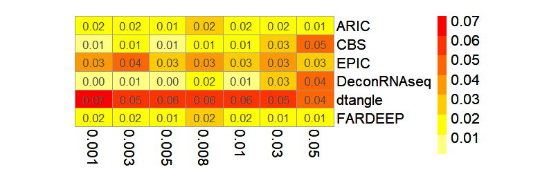

# **decone**: An easy-to-use and comprehensive evaluation toolkit for cell type deconvolution from expression data


**Links**:

- [decone documentaion](123)
- [decone vignettes](123)


## Section 1: Introduction
Cell type proportion is related to phenotypes or diseases ([Wei, *et al.*](https://doi.org/10.1093/bib/bbab362)). Therefore, quantifying cell or tissue proportions is an important problem in bioinformatics.

Here, we proposed a cell type <u>decon</u>volution <u>e</u>valuating toolkit named '**decone**' to perform comprehensive and systematic analysis for different algorithms.

**decone** consists of 6 main part functions as below.
- Pseudo bulk data generation (including bulk and single cell).
- Stability analysis under different types of noise.
- Rare component analysis.
- Unknown component analysis.
- Comprehensive evaluation metrics.
- Well characterized datasets for deconvolution utilities.

In the following parts, we will introduce each function along with how to compute the evaluation metrics for comparison of different deconvolution methods.

## Section 2: Installation

decone is based on R and can be easily installed on Windows, Linux as well as MAC OS.

First, users should install [R](https://www.r-project.org/).

Next, install devtools and decone.

```
# install devtools
install.packages('devtools')

# install the decone package
devtools::install_github('Honchkrow/decone')

# load decone
library(decone)
```

## Section 3: Gnerating Pseudo Bulk Data

Generating pseudo-bulk data is a challenging problem. Inspired by the former work ([Francisco, *et al.*](https://doi.org/10.1038/s41467-020-20288-9), [Wang, *et al.*](https://doi.org/10.1038/s41467-018-08023-x), [Wei, *et al.*](https://doi.org/10.1093/bib/bbab362)) and [Tumor Deconvolution DREAM Challenge](https://www.synapse.org/#!Synapse:syn15589870/wiki/), decone provides different pseudo data generation strategies from bulk RNA-seq data as well as scRNA-seq data.

### Section 3.1: Gnerating Pseudo Bulk Data From Massive RNA-seq Studies

Many deconvolution methods need cell type-specific bulk data as the prior knowledge during deconvolution. To have a more realistic simulation, we collected 302 well-characterized bulk RNA-seq data to generate pseudo bulk data. When generating data, 1/3 samples will be used for generating the mixture and the rest will be used for generating external reference.

Inspired by [Tumor Deconvolution DREAM Challenge](https://www.synapse.org/#!Synapse:syn15589870/wiki/), decone also provides to generate 'coarse' and 'fine' level mixture samples. 

For **'coarse'** level sample, decone generates mixture sample which contains the following 8 cell types.
- B cells
- CD4 T cells
- CD8 T cells
- endothelial cells
- macrophages
- monocytes
- neutrophils
- NK cells. 

For **'fine'** level, there will be 14 cell types.
- memory B cells
- naive B cells
- memory CD4 T cells
- aive CD4 T cells
- regulatory T cells
- memory CD8 T cells
- naive CD8 T cells
- NK cells
- neutrophils
- monocytes
- myeloid dendritic cells
- macrophages
- fibroblasts
- endothelial cells

The following demo shows how to generate simulated samples. Considering that methods may be written in different languages, we output the simulated data as CSV files.

```R
# create the folder 'test' before running
exprSim(n_sample = 50,  # generating 50 samples
        type = 'coarse',  # can be changed to 'fine'
        transform = 'TPM', 
        outputPath = "./test",
        mix_name = "coarse_mix.csv",  # simulated 50 mixture samples
        ref_name = "coarse_ref.csv",   # cell type specific reference
        prop_name = "coarse_prop.csv",  # simulated porportions
        refVar_name = "coarse_refVar.csv",  # expression variance for cell type specific reference
        train_name = "train_data.csv")  # data for generating reference

```

The proportion will be generated randomly from a uniform distribution ([Wei, *et al.*](https://doi.org/10.1093/bib/bbab362)). decone also outputs the data for generating the external reference which can be used for differential expression analysis in marker gene selection.


### Section 3.2: Gnerating Pseudo Bulk Data From scRNA-seq data

With the development of single cell technologies, cell type deconvolution could be more accurate. Lots of single cell-based methods had been proposed such as [MuSiC](https://doi.org/10.1038/s41467-018-08023-x) and [SCDC](https://doi.org/10.1093/bib/bbz166). In addition, constructing in silico bulk data also becomes direct. [Han, *et al.*](https://doi.org/10.1016/j.cell.2018.02.001) built a scRNA-seq atlas for the mouse with high quality and decone adopted this study to perform in silico mixing. For a solid simulation, decone adopted 7 tissues from the femal fetal mouse and 1500 cells for each, including stomach, lung, liver, kidney, intestine, brain, and gonad.

The method for generating bulk data is similar with Section 3.1.

```R
# create the folder 'test' before running
scExprSim(n_sample = 50,
          p = 2 / 3,
          transform = "TPM",
          outputPath = "./test",
          mix_name = "scMouse_gene_expr.csv",
          ref_name = "scMouse_ref.csv",
          prop_name = "scMouse_prop.csv",
          train_name = "scMouse_ref_rawCount.csv")  # data for generating reference

```

### Section 3.3: Evaluating The Deconvolution Results For Single Method

In this part, we will demonstrate how to analyze the results of a single deconvolution method.

We adopted [EpiDISH](https://www.bioconductor.org/packages/release/bioc/html/EpiDISH.html) which provides 3 types of deconvolution algorithms as the demo.

First, generating simulated expression data.

```R
# install EpiDISH
if (!require("BiocManager", quietly = TRUE))
    install.packages("BiocManager")

BiocManager::install("EpiDISH")

# generate bulk data
exprSim(n_sample = 50,  # generating 50 samples
        type = 'coarse',  # can be changed to 'fine'
        transform = 'TPM', 
        outputPath = "./test",
        mix_name = "coarse_mix.csv",  # simulated 50 mixture samples
        ref_name = "coarse_ref.csv",   # cell type specific reference
        prop_name = "coarse_prop.csv",  # simulated porportions
        refVar_name = "coarse_refVar.csv",  # expression variance for cell type specific reference
        train_name = "train_data.csv")  # data for generating reference
```

Second, use [EpiDISH](https://www.bioconductor.org/packages/release/bioc/html/EpiDISH.html) to deconvolute the bulk data and save the result.

```R
library(EpiDISH)

mix <- read.csv(file = "./test1/coarse_mix.csv", header = T, row.names = 1)
ref <- read.csv(file = "./test1/coarse_ref.csv", header = T, row.names = 1)

# For a fast demo, we use only 500 markers.
mix <- as.matrix(mix[1:500, ])
ref <- as.matrix(ref[1:500, ])

res <- epidish(beta.m = mix, ref.m = ref, method = "CBS")
prop_pred <- t(res$estF)

write.csv(x = prop_pred, file = "./test1/prop_pred.csv", row.names = T, quote = F)
```

Next, using decone to Evaluate the deconvolution results.

```R
actual <- "./test1/coarse_prop.csv"
predicted <- "./test1/prop_pred.csv"

# Plot boxplot for different metrics
# Evaluation method can be changed to "rmse", "mape", "mae", "pearson" or "spearman".
res <- boxplot_simple(actual = actual,
                      predicted = predicted,
                      method = "rmse")
res$plot
```

The rmse boxplot of 50 samples will be like below.

<center>
    
    <br>
    <div style="color:orange; border-bottom: 1px solid #d9d9d9;
    display: inline-block;
    color: #999;
    padding: 2px;">Boxplot of rmse value for 50 samples</div>
</center>

For generating the comparison plot between different methods under a certain dataset, please check the **Section 4**.

Also, users can generate pretty scatter figure for each dataset like below.

```R
# Plot scatter-plot for different metrics
# Evaluation method can be changed to "pearson" (default), "kendall", or "spearman".
res <- scatter_simple(actual = actual,
                      predicted = predicted,
                      method = "spearman")
res$plot
```

<center>
    
    <br>
    <div style="color:orange; border-bottom: 1px solid #d9d9d9;
    display: inline-block;
    color: #999;
    padding: 2px;">Scatter-plot of rmse value for 50 samples</div>
</center>

Generally, when a new deconvolution approach is proposed, cross-comparison between different methods is needed. decone provides multi-level comparison and visualization functions. The cross-comparison function will be introduced along with the next parts.

## Section 4: Noise Analysis

In expression data analysis, technical and biological noise cannot be ignored. Noise existing in bulk data brings a negative influence on deconvolution. In order to measure the stability and accuracy of different methods, decone provides functions to add noise with the different structures on bulk data.


### Section 4.1: Generating Noised Bulk Data With Negative Binomial Model

Many of the studies adopted the normal or log-normal model to generate noised bulk data. However, as [Jin, *et al.*](https://doi.org/10.1186/s13059-021-02290-6) pointed out, the negative binomial model recapitulates noise structures of real bulk data. 

Function "addNoiseExpr" can produce noise based on normal, log-normal or negative binomial model ([Jin, *et al.*](https://doi.org/10.1186/s13059-021-02290-6)). We strongly recommended using the **negative binomial** model. A simple example is provided as the following code.

```R
# generate a simulated dataset with 50 samples and 200 marker genes with function 'pseudoExpr'
res <- pseudoExpr(n_sample = 50, n_gene = 200)

# users can check the dimension of output
dim(res$mix)
dim(res$ref)
dim(res$prop)

# save the bulk data
write.csv(x = res$mix, file = "mix.csv", row.names = T, quote = F)
write.csv(x = res$ref, file = "ref.csv", row.names = T, quote = F)
write.csv(x = res$prop, file = "prop.csv", row.names = T, quote = F)

# the new data will be generated in a folder
addNoiseExpr(exprFile = "mix.csv", 
             Pt = seq(0.1, 1, 0.1),  # parameter to control noise level
             type = "NB")  # "NB", "N" or "LN". 3 types of model.
```

A folder named "mix" will be generated and bulk data with different levels of noise will be saved in each file respectively like below.

``` 
mix.csv
mix/  
  ├── mix_NL_0.csv     # original data without in silico noise
  ├── mix_NL_0.1.csv   # noise level 0.1
  ├── mix_NL_0.2.csv 
  ├── mix_NL_0.3.csv 
  ├── mix_NL_0.4.csv 
  ├── mix_NL_0.5.csv 
  ├── mix_NL_0.6.csv 
  ├── mix_NL_0.7.csv 
  ├── mix_NL_0.8.csv 
  ├── mix_NL_0.9.csv 
  └── mix_NL_1.csv     # noise level 1
```

After this, users can test the performance of different methods easily.


### Section 4.2: Evaluating The Deconvolution Results For Multiple Method

Comparison the deconvolution performance between different algorithms helps to find the appropriate method for a certain biology scenario.

Here, taking stability analysis as an example, we show how to use decone to perform cross-comparison between different methods. In order to give a direct and fast example, we use [EpiDISH](https://www.bioconductor.org/packages/release/bioc/html/EpiDISH.html), [DeconRNAseq](https://www.bioconductor.org/packages/release/bioc/html/DeconRNASeq.html) as well as [FARDEEP](https://cran.r-project.org/web/packages/FARDEEP/index.html) to perform deconvolution.

```R
library(EpiDISH)
library(DeconRNASeq)
library(FARDEEP)

ref <- as.matrix(read.csv(file = "ref.csv", header = T, row.names = 1))

for (NL in seq(0, 1, 0.1)) {
    writeLines(paste("Now, processing noise level:", NL, sep = " "))
    mixFile <- paste0("./mix/mix_NL_", NL, ".csv")
    mix <- as.matrix(read.csv(file = mixFile, header = T, row.names = 1))

    # deconvolute with CIBERSORT algorithm
    res1 <- epidish(beta.m = mix, ref.m = ref, method = "CBS")
    p1 <- t(res1$estF)
    # deconvolute with RPC algorithm
    res2 <- epidish(beta.m = mix, ref.m = ref, method = "RPC")
    p2 <- t(res2$estF)
    # deconvolute with DeconRNASeq algorithm
    res3 <- DeconRNASeq(datasets = as.data.frame(mix), signatures = as.data.frame(ref))
    p3 <- t(res3$out.all)
    # deconvolute with FARDEEP algorithm
    res4 <- fardeep(X = ref, Y = mix)
    p4 <- t(res4$relative.beta)

    # save the results
    write.csv(x = p1, file = paste0("./mix/CBS_", NL, ".csv"), row.names = T, quote = F)
    write.csv(x = p2, file = paste0("./mix/RPC_", NL, ".csv"), row.names = T, quote = F)
    write.csv(x = p3, file = paste0("./mix/DeconRNASeq_", NL, ".csv"), row.names = T, quote = F)
    write.csv(x = p4, file = paste0("./mix/FARDEEP_", NL, ".csv"), row.names = T, quote = F)
}
```

First, we want to see the performance of a single method under different levels of noise. Let's take CIBERSORT algorithm provided by [EpiDISH](https://www.bioconductor.org/packages/release/bioc/html/EpiDISH.html) as an example.

We can generate the rmse trend along with different noise levels. Also, we can plot the cell type-specific metrics to see the <font color=red>estimation bias</font> for each cell types.

```R
# the real proportion
actual <- "prop.csv"

# predicted proportions 
predicted <- paste0("./mix/CBS_", seq(0, 1, 0.1), ".csv")

# generate box plot of rmse value
res <- boxplot_NGrad(actual = actual,
                     predicted = predicted,
                     label = paste0("NL_", seq(0, 1, 0.1)),
                     method = "rmse")

res$plot

# generate heatmap of mape for each cell types
res <- heatmap_NGradCT(actual = actual,
                       predicted = predicted,
                       label = paste0("NL_", seq(0, 1, 0.1)),
                       method = "mape")
res$plot
```

The output figures are as follows.

<center>
    
    <br>
    <div style="color:orange; border-bottom: 1px solid #d9d9d9;
    display: inline-block;
    color: #999;
    padding: 2px;">Box plot for rmse value of CIBERSORT</div>
</center>


It is clear that with the growth of noise power, the deconvolution results become worse.


<center>
    
    <br>
    <div style="color:orange; border-bottom: 1px solid #d9d9d9;
    display: inline-block;
    color: #999;
    padding: 2px;">Cell type specific mape value for CIBERSORT</div>
</center>

Of course, cell types specific results are influenced by noise power. **However, this issue is still not fully studied.**

Next, we want to have a comprehensive cross-comparison between different methods.

```R
# the real proportion
actual <- "prop.csv"

# predicted proportions as a list
RPC <- paste0("./mix/RPC_", seq(0, 1, 0.1), ".csv")
CBS <- paste0("./mix/CBS_", seq(0, 1, 0.1), ".csv")
DeconRNASeq <- paste0("./mix/DeconRNASeq_", seq(0, 1, 0.1), ".csv")
FARDEEP <- paste0("./mix/FARDEEP_", seq(0, 1, 0.1), ".csv")
predicted <- list(RPC = RPC,
                  CBS = CBS,
                  DeconRNASeq = DeconRNASeq,
                  FARDEEP = FARDEEP)

noise_level <- paste0("NL_", seq(0, 1, 0.1))

# boxplot
boxplot_NcrossCompare(actual = actual,
                      predicted = predicted,
                      label = noise_level,
                      method = "rmse")

# heatmap
heatmap_NcrossCompare(actual = actual,
                      predicted = predicted,
                      label = noise_level,
                      method = "mape")
```

The boxplot and heatmap for rmse and mape are as follows.

<center>
    
    <br>
    <div style="color:orange; border-bottom: 1px solid #d9d9d9;
    display: inline-block;
    color: #999;
    padding: 2px;">Boxplot of rmse for different deconvolution method</div>
</center>


<center>
    
    <br>
    <div style="color:orange; border-bottom: 1px solid #d9d9d9;
    display: inline-block;
    color: #999;
    padding: 2px;">Heatmap of mape for different deconvolution method</div>
</center>


Usually, only one metric may not be sufficient to reveal the deconvolution efficacy ([Wei, *et al.*](https://doi.org/10.1093/bib/bbab362)). decone provides circle heatmap function for illustrating the double metrics in one figure.


```R
# generate figure for rmse and pearson 
cheatmap_NcrossCompare(actual = actual,
                       predicted = predicted,
                       label = noise_level,
                       method1 = "rmse",
                       method2 = "pearson")
```

<center>
    
    <br>
    <div style="color:orange; border-bottom: 1px solid #d9d9d9;
    display: inline-block;
    color: #999;
    padding: 2px;">circle heatmap of rmse and PCC for different deconvolution method</div>
</center>


## Section 5: Rare Component Analysis

In the cell type deconvolution problem, cell types with extremely small proportion are always been ignored. However, these cell types play vital roles in some situations, like TILs which exhibit low fractions in many cancer tissues. Some methods have been proposed to tackle this problem like [DWLS](https://doi.org/10.1038/s41467-019-10802-z) and [ARIC](https://doi.org/10.1093/bib/bbab362).


decone provides functions 'rareExprSim' and 'rarescExprSim' to simulate bulk data with the rare component. In order to perform a comprehensive analysis, decone takes all the cell types as potential rare components in a loop with a pre-set rare proportion gradient.

Here is an example with 6 different deconvolution algorithms.

First, generate in silico rare proportion dataset.
```R
# rare proportion is set to 0.001, 0.003, 0.005, 0.008, 0.01, 0.03 and 0.05
rareExprSim(p_rare = c(0.001, 0.003, 0.005, 0.008, 0.01, 0.03, 0.05),
            type = "coarse",
            transform = "TPM")
```

Second, deconvolute the simulated bulk data with different algorithms. Here, we directly takes the deconvolution results from [ARIC](https://doi.org/10.1093/bib/bbab362), [CIBERSORT](https://doi.org/10.1038/nmeth.3337), [EPIC](10.1007/978-1-0716-0327-7_17), [dtangle](10.1093/bioinformatics/bty926), [FARDEEP](10.1371/journal.pcbi.1006976) as well as [DeconRNAseq](10.1093/bioinformatics/btt090) as an example.


We can generate a scatter plot for each method like below.

```R
actual <- "./coarse_prop.csv"
predicted <- "./EPIC_coarse_p-0.01_fc-2.csv"
scatter_R(actual = actual,
          predicted = predicted,
          p_rare = c(0.001, 0.003, 0.005, 0.008, 0.01, 0.03, 0.05),
          celltype = TRUE)
```

<center>
    
    <br>
    <div style="color:orange; border-bottom: 1px solid #d9d9d9;
    display: inline-block;
    color: #999;
    padding: 2px;">Scatter plot of rare component for EPIC</div>
</center>

From the above figure, users can analyze the deconvolution power for each cell type.

Also, we can heatmap and circle heatmap to have a cross-comparison.

```R
actual <- "./coarse_prop.csv"
predicted <- Sys.glob("./*_coarse_p-0.01_fc-2.csv")
label <- c("ARIC", "CBS", "EPIC", "DeconRNAseq", "dtangle", "FARDEEP")

heatmap_RcrossCompare(actual,
                      predicted,
                      p_rare = c(0.001, 0.003, 0.005, 0.008, 0.01, 0.03, 0.05),
                      label = label,
                      method = "rmse")

cheatmap_RcrossCompare(actual,
                       predicted,
                       p_rare = c(0.001, 0.003, 0.005, 0.008, 0.01, 0.03, 0.05),
                       label = label,
                       method1 = "rmse",
                       method2 = "mape")
```

<center>
    
    <br>
    <div style="color:orange; border-bottom: 1px solid #d9d9d9;
    display: inline-block;
    color: #999;
    padding: 2px;">Heatmap plot for rmse</div>
</center>


<center>
    
    <br>
    <div style="color:orange; border-bottom: 1px solid #d9d9d9;
    display: inline-block;
    color: #999;
    padding: 2px;">circle heatmap plot for rmse and mape</div>
</center>

## Section 5: Unknown Component Analysis

Almost all physiological and pathological processes in multicellular organisms involve multiple cell types ([Wei, *et al.*](https://doi.org/10.1093/bib/bbab362)). It is hard to identify all the cell types in the microenvironment. The unknown component is a nonnegligible problem for all deconvolution algorithms and methods like [EPIC](10.1007/978-1-0716-0327-7_17) have considered this problem.

To test the estimation accuracy when there exists a nonnegligible cell type, decone provides the function to generate simulated bulk data which drops a certain cell type.

```R
# generate bulk data
unExprSim(unknown = "neutrophils",  # drop neutrophils. if NULL, randomly drop a cell type.
          n_sample = 50,
          type = "coarse",
          outputPath = "./un",
          transform = "TPM",
          mix_name = "coarse_gene_expr.csv",
          ref_name = "coarse_ref.csv",
          prop_name = "coarse_prop.csv")
```

After this, users can use the functions mentioned above to perform single-method evaluation or cross-comparison evaluation.


## Section 7: Single Cell Related Functions

Single cell related functions are similar with functions used for massive bulk data, like 'unscExprSim', 'rarescExprSim' and 'unscExprSim'. For more information, please refer to [decone manual](111).

## Section 8: Well-Characterized Deconvolution Datasets

In addition, we collected 14 well-characterized deconvolution datasets for users. Some of them are known cell-type proportions. Some datasets without know the true proportion, but the related phenotype can be accessed. We provide the processed datasets with **bulk data**, **reference data** as well as **true proportions**, which means that these datasets can be used directly. We summarized the datasets in the following table. 

| NO. | NAME | Description | Type | Proportion | Source |
| :----: | :----: | :----: | :----: | :----: | :----: |
| 1 | Abbas | Microarray | Bulk | known | [Abbas, *et al.*](https://doi.org/10.1371/journal.pone.0006098) |
| 2 | Becht | Microarray | Bulk | known | [Becht, *et al.*](https://doi.org/10.1186/s13059-016-1070-5) |
| 3 | Gong | Microarray | Bulk | known | [Gong, *et al.*](https://doi.org/10.1371/journal.pone.0027156) |
| 4 | Kuhn | Microarray | Bulk | known | [Kuhn, *et al.*](https://doi.org/10.1038/nmeth.1710) |
| 5 | Linsley | RNA-seq | Bulk | known | [Linsley, *et al.*](https://doi.org/10.1371/journal.pone.0109760) |
| 6 | Liu | RNA-seq | Bulk | known | [Liu, *et al.*](10.1093/nar/gkv412) |
| 7 | Parsons | RNA-seq | Bulk | known | [Parsons, *et al.*](https://doi.org/10.1186/s12864-015-1912-7) |
| 8 | Shen-Orr | Microarray | Bulk | known | [Shen-Orr, *et al.*](https://doi.org/10.1038/nmeth.1439) |
| 9 | Shi | Microarray | Bulk | known | [Shi, *et al.*](10.1038/nbt1239) |
| 10 | T2D | RNA-seq | single cell | known | [Fadista, *et al.*](10.1073/pnas.1402665111) |
| 11 | TCGA_LUSC | RNA-seq | Bulk | known | [Vasaikar, *et al.*](https://doi.org/10.1093/nar/gkx1090) |
| 12 | TCGA_OV | RNA-seq | Bulk | known | [Vasaikar, *et al.*](https://doi.org/10.1093/nar/gkx1090) |
| 13 | kidney_Arvaniti | RNA-seq | single cell | known | [	Arvaniti, *et al.*](10.1038/srep26235) |
| 14 | kidney_Arvaniti_TPM | RNA-seq | single cell | known | [	Arvaniti, *et al.*](10.1038/srep26235) |
| 15 | kidney_Craciun | RNA-seq | Bulk | known | [Craciun, *et al.*](10.1681/ASN.2015020225) |
| 16 | kidney_Craciun_TPM | RNA-seq | Bulk | known | [Craciun, *et al.*](10.1681/ASN.2015020225) |

Note: some dataset are collected from [dtangle](10.1093/bioinformatics/bty926) and [MuSiC](https://doi.org/10.1038/s41467-018-08023-x).

Please cite the corresponding article when you use the datasets.

## Citation

Zhang, W., Xu, H., Qiao, R., Zhong, B., Zhang, X., Gu, J., Zhang, X., Wei, L. and Wang, X., 2022. ARIC: accurate and robust inference of cell type proportions from bulk gene expression or DNA methylation data. Briefings in Bioinformatics, 23(1), p.bbab362.


